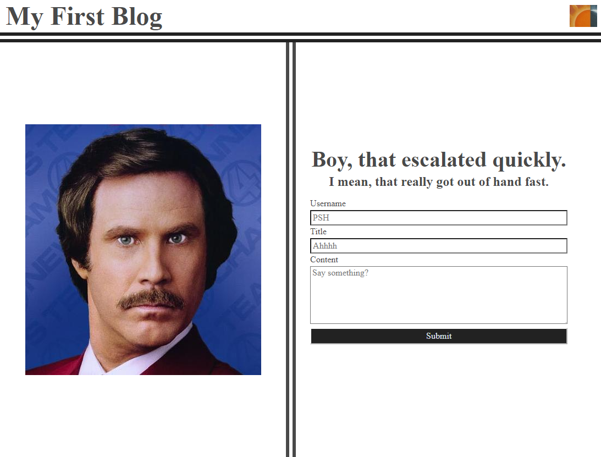
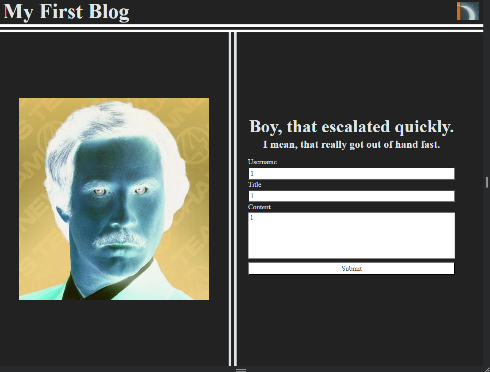
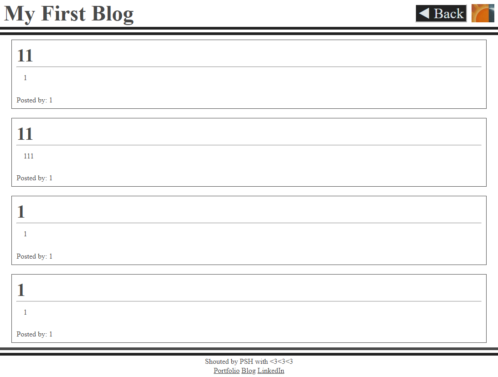
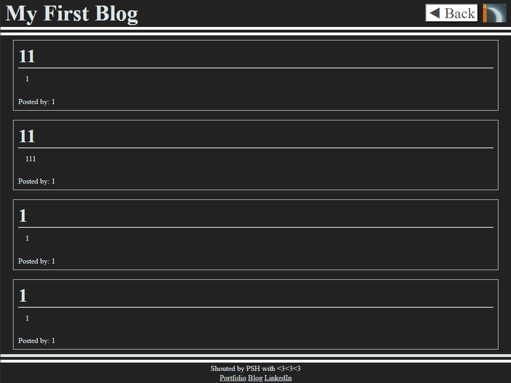

# my-first-blog
A very simple blog that showcases dark/light mode and take blogposts.  Stores them in local storage.

## Project Title: 
My First Blog

## Description:
The blog has a header contains the title and a dark/light switch.  On the bottom right is the form to submit the blog post.  If submitted a valid post, browser would be redirect to blog.html where all the available posts are shown.  The header section would also show the back button to take the user back to the front page.  dark/light mode status would be consistent across the two pages.

## Installation:
N/A 

## Usage:
open https://momokokong.github.io/my-first-blog/ directly from a browser.  Enter some text in the form then submit to start. Click on the sun/moon icon on the top right to trigger dark/light mode accordingly.

## Screenshot:
Fronpage:  

Frontpage-dark-with-valid-inputs:  

Blogposts:  

Blogposts-dark:  

## Contributing:
Let me know if there any tips to improve the page

## License: 
MIT 

## Contact:
[LinkedIn](https://www.linkedin.com/in/poshinhuang/)
